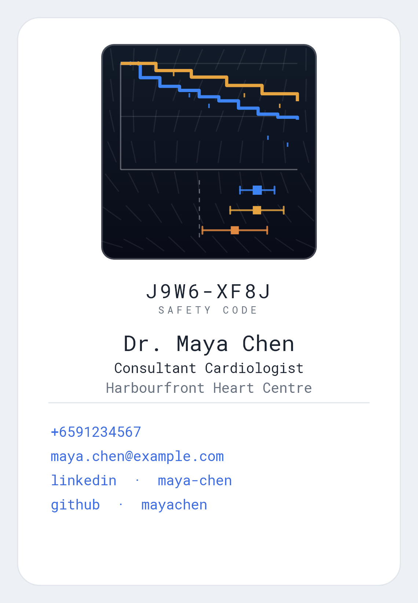
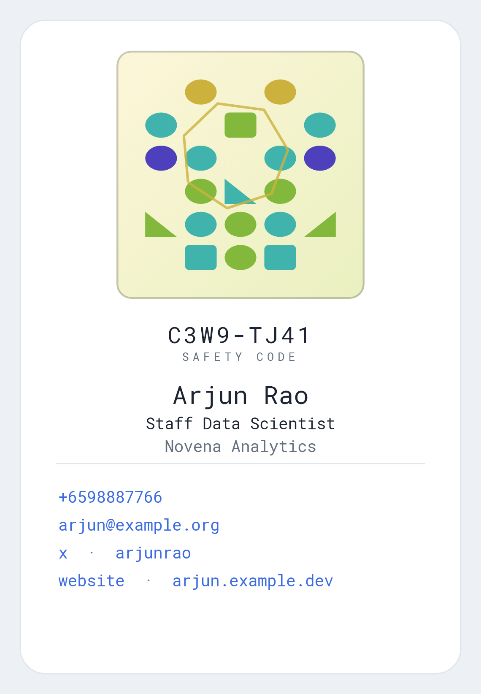
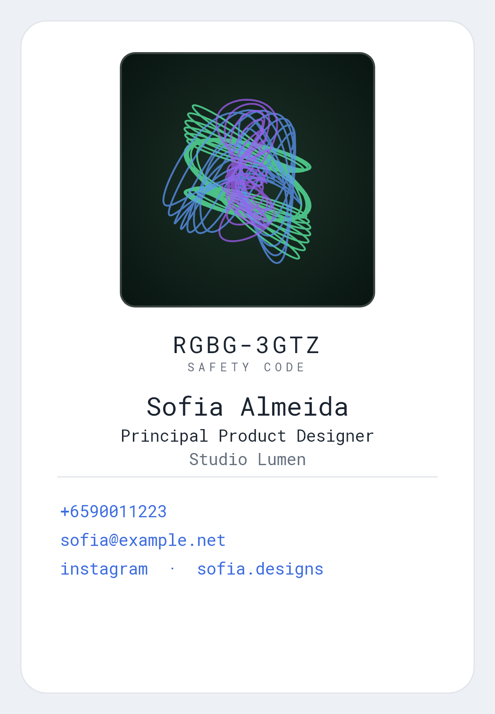
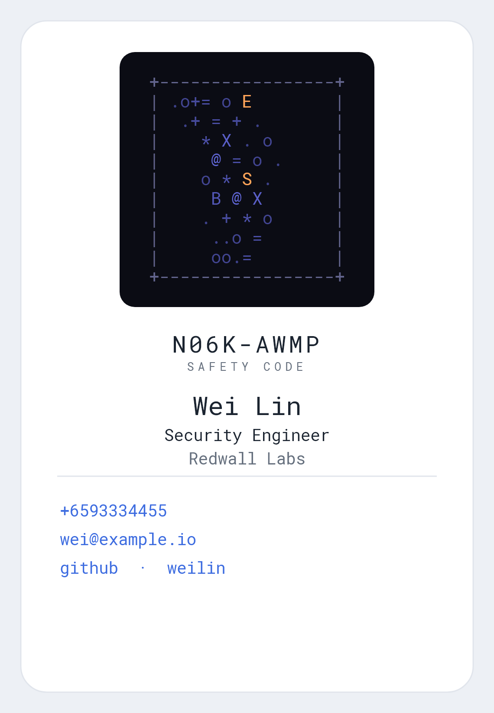
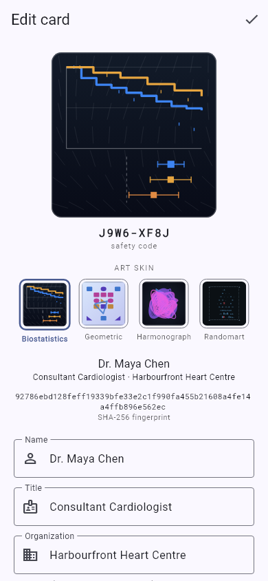
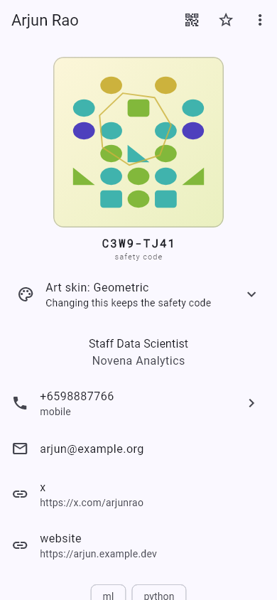
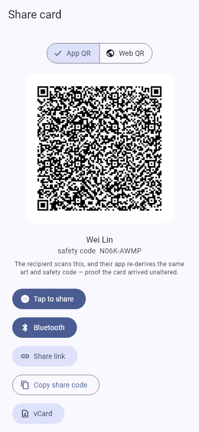

# namecard_vision

**A digital namecard where the card's identity is a picture you can verify.**

Every card is hashed with SHA‑256, and that hash is drawn as generative art —
so the picture on a card is both a piece of art *and* a checksum of its
contents. Change one character of the name, phone or email and the art changes
completely. Share a card by QR, link, NFC or Bluetooth; the recipient's app
re‑derives the same art and a short **safety code** from the data it received —
if they match what the sender shows, the card arrived intact.

Cross‑platform (Android + iOS) Flutter app. Offline‑first, no backend, no
accounts, no tracking.

> The cards below are fictional demo data.

<table>
  <tr>
    <td align="center"><br><sub><b>Biostatistics</b> — Kaplan–Meier curves + forest plot</sub></td>
    <td align="center"><br><sub><b>Geometric</b> — mirror‑symmetric identicon</sub></td>
    <td align="center"><br><sub><b>Harmonograph</b> — damped pendulum curves</sub></td>
    <td align="center"><br><sub><b>Randomart</b> — OpenSSH drunken‑bishop</sub></td>
  </tr>
</table>

## How the verification works

1. A card's fields are serialized in a **canonical, field‑ordered** form, so the
   same content always produces the same bytes on any device.
2. Those bytes are hashed with **SHA‑256** → a 256‑bit digest.
3. The digest seeds a deterministic PRNG that drives the art. All 256 bits feed
   the picture, so it's a faithful fingerprint, not decoration.
4. A short human‑readable **safety code** (e.g. `9VAZ‑8MM0`) is shown beneath the
   art. Two people compare codes — or just glance at the two pictures — to
   confirm a shared card wasn't altered in transit.

The art is **never transmitted** — it's always recomputed from the data on the
receiving side. That's what makes it a check rather than a logo. The rendering
uses only integer‑exact math so a card looks **pixel‑identical on Android, iOS
and the web viewer**.

The chosen **art skin travels with the card but is deliberately *not* part of the
hash** — restyling a card never changes its safety code, because the code
verifies *content*, not appearance.

## Features

- **Verifiable generative‑art fingerprint** with four selectable skins
  (Biostatistics · Geometric · Harmonograph · Randomart), switchable live from
  the editor or the card viewer.
- **Editor** for name, title, org, phone, email, tags, note and **social / web
  links** (LinkedIn · GitHub · X · Instagram · Website).
- **Searchable collection** (full‑text over name / org / title / tags / note),
  pinning, and a "my card" role.
- **Share many ways** — QR code, a backend‑free **web link** (card rides in the
  URL fragment, never hits a server), **NFC** tap, and phone‑to‑phone
  **Bluetooth**.
- **Works with people who don't have the app** — a QR still yields a standard
  **vCard**, and the web link opens in any browser. *(Bluetooth is app‑to‑app
  only: it uses a private BLE service, so both phones need the app.)*
- **Scan a physical card** (on‑device OCR) to prefill a new card.
- **Save to phone contacts**, and **`.ncv` backup/restore** to move a whole
  collection between devices.
- **Offline‑first**: everything is stored locally (SQLite); no network calls
  except opening links you tap.

## Screens

<table>
  <tr>
    <td align="center" width="33%"><br><sub><b>Editor</b><br>Live fingerprint preview, art-skin picker, and fields for contacts &amp; social links.</sub></td>
    <td align="center" width="33%"><br><sub><b>Card viewer</b><br>Art + safety code + tappable contacts; switch the skin without leaving the card.</sub></td>
    <td align="center" width="33%"><br><sub><b>Share</b><br>Verifiable App/Web QR, plus Bluetooth, link, copy, and vCard.</sub></td>
  </tr>
</table>

## Try it

- **Live web viewer (a demo card):**
  [open Dr. Maya Chen's card →](https://lauyeehow1986-hub.github.io/namecard_vision/#A%2B9F%2BAX20*F4BECFZCWF7HT8I%2459Z9NFFO34%2B8DO-D3Q5BWEEWEFZCWF7SN8F%2FD0%25E3WEG%2FDO34GECAVC*3EY3E%2BEDUUE3Q504EW1DWF7Y69WKE34E%20KE0LEG%2FDT34X%20C5LEO341%24CKWEFZC3Q5L9E-3E6%24CWE4JPB%24F40EC%3A%20CWE4%25F4T3EXEDFZC3Q5UZCG%256WE4HE4H%256GA7QF60R6J%2569G42ZBUF4B%24DXED%3AOE%3AG7%25F4NEC%25CCNPC1%24CF68%249FQ%24DTVD%2B%255%2B3EMF43Q5VQEOPCAEC%3AOE%3AG7MPFP9EIECX.C%2FKEWE4%24F4ZED%2FPDAVCO-D3Q5%208D0%2FDTVDWE4%25F4NEC%24CCNPC1%24CIE41G4.KEWE48E44%24FMPFP9EIECX.C%2FKEWE4WF4-EDB9DCIC3Q5%208D0%2FDTVDWE4%25F4NEC1EC%2B8DO-D3Q56%25E7UDWF79G42ZB*F424EFZCWF7IE40G45EC%3AOE%3AG7SF4GECAVC*3EY3E5EF3Q5ZKELQEGECNPCMF43Q5KECIECGECMOA.CCWW6WE4H%2FD%20VDZ2)
  — the fingerprint and safety code are recomputed in your browser from the data
  in the link.
- **Android APK:** grab the latest from
  [**Releases**](https://github.com/lauyeehow1986-hub/namecard_vision/releases/latest),
  then `adb install -r app-release.apk`.

## Build & run

Requires Flutter (3.13+).

```bash
flutter pub get
flutter run                       # on a connected device / emulator

flutter test                      # unit + widget tests
flutter build apk --release       # Android (needs android/key.properties)
flutter build web -t lib/main_web.dart --base-href /namecard_vision/   # web viewer
```

Regenerate the README screenshots with:

```bash
flutter test tool/gen_shots.dart  # writes screenshots/*.png
```

## Tech

Flutter · Drift (SQLite + FTS5) · `crypto` (SHA‑256) · `qr_flutter` +
`mobile_scanner` · `nfc_manager` · `bluetooth_low_energy` ·
`google_mlkit_text_recognition` · custom `dart:ui` Canvas rendering for the
fingerprint art.

## Disclaimer

A personal / portfolio project. The safety code guards against **accidental or
in‑transit alteration** of a shared card; it is not a substitute for an
authenticated identity system. All names and contact details in the screenshots
and demo links are fictional.
